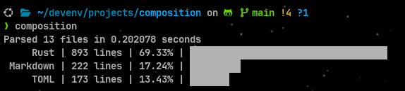

<div align="center">



</div>

# composition
**composition** is a modular lines-of-code CLI tool to analyze and display code composition in directories

# Features
- **Multi-language tracking** - Analyze code by file extensions with customizable language groupings
- **Smart filtering** - Respect `.gitignore`, exclude dotfiles/dotfolders, and apply custom ignore patterns
- **Global & language-specific exclusions** - Define regex patterns globally or per-language for precise line filtering
- **Parallel processing** - Efficiently analyze large codebases with parallelized file processing
- **Configurable analysis** - TOML-based configuration with CLI overrides for flexible usage
- **Visual contribution bars** - Scalable visual representation of code composition with optional color coding

# Setup
1. Install Binary
    - crates.io
    ```bash
    cargo install composition-cli --locked
    ```

    - Build from Source
    ```bash
    git clone https://github.com/lalitm1004/composition.git
    cd composition
    cargo build --release
    # built binary can be found at ./target/release/composition
    ```

2. Create `config.toml` at:
    - Linux / Unix
    ```bash
    $HOME/.config/composition/config.toml
    ```
    - macOS
    ```bash
    $HOME/Library/Application Support/composition/config.toml
    ```

    - Windows
    ```
    %appdata%/composition/config.toml
    ```
    - Or the **default configuration directory** on your system

3. Populate based on [configuration guidelines](#configuration-guidelines)

> **NOTE**: A missing/invalid config.toml results in falling back to the [default](https://github.com/lalitm1004/composition/blob/main/config.toml)

# Usage
| Flag / Argument        | Type              | Default     | Description                                   |
| ---------------------- | ----------------- | ----------- | --------------------------------------------- |
| `PATH`                 | `Optional<Path>`  | `Path('.')` | Path to the directory of files to process.    |
| `--scale-bar`          | `Optional<float>` | `1.0`       | Scale factor for the contribution bar.        |
| `--use-color`          | `Optional<bool>`  | *config**   | Override `use_color` config setting.          |
| `--respect-gitignore`  | `Optional<bool>`  | *config**   | Override `respect_gitignore` config setting.  |
| `--ignore-dotfolders`  | `Optional<bool>`  | *config**   | Override `ignore_dotfolders` config setting.  |
| `--ignore-dotfiles`    | `Optional<bool>`  | *config**   | Override `ignore_dotfiles` config setting.    |
| `--ignore-empty-lines` | `Optional<bool>`  | *config**   | Override `ignore_empty_lines` config setting. |

> *config** : Defaults to the value defined in the `config.toml` file [or its default]

> **NOTE**: command-line flags take precedence over values in `config.toml` 

# Configuration Guidelines

**config.toml fields:**

| Field Name            | Type                       | Default Value                      | Description                                                                                                                                      |
| --------------------- | -------------------------- | ---------------------------------- | ------------------------------------------------------------------------------------------------------------------------------------------------ |
| `use_color`           | `Optional<bool>`           | `false`                            | Enables colored output in the CLI                                                                                                                |
| `respect_gitignore`   | `Optional<bool>`           | `true`                             | Determines whether files/folders ignored by `.gitignore` should also be ignored by this tool                                                     |
| `ignore_dotfolders`   | `Optional<bool>`           | `true`                             | If `true`, folders starting with `.` are ignored                                                                                                 |
| `ignored_directories` | `Optional<Array[String]>`  | [Check here](#ignored_directories) | List of directories to explicitly ignore during analysis                                                                                         |
| `ignore_dotfiles`     | `Optional<bool>`           | `true`                             | If `true` files starting with `.` are ignored                                                                                                    |
| `ignored_files`       | `Optional<Array[String]>`  | [Check here](#ignored_files)       | List of specific files to explicitly ignore                                                                                                      |
| `ignore_empty_lines`  | `Optional<bool>`           | `true`                             | If `true`, empty lines are not counted in the analysis                                                                                           |
| `excluded_patterns`   | `Optional<Array[String]>`  | [Check here](#excluded_patterns)   | List of **VALID** regex patterns to exclude from analysis. A line matching **ANY** of these patterns results in it being discarded from analysis |
| `tracked`             | `Optional<Array[Tracked]>` | [Check here](#tracked)             | List of `Tracked` structs defining file types/extensions to analyze and their display settings                                                   |

**Tracked struct fields:**

| Field Name          | Type                      | Default Value | Description                                                                                                                                                  |
| ------------------- | ------------------------- | ------------- | ------------------------------------------------------------------------------------------------------------------------------------------------------------ |
| `display`           | `String`                  | *required*    | Label or name to display for this tracked language. Must be unique across all `Tracked` structs                                                              |
| `extensions`        | `Array[String]`           | *required*    | File extensions associated with this tracked language                                                                                                        |
| `color`             | `Optional<String>`        | `None`        | Color to use when displaying this tracked language. Only used if `use_color` is set to `true`. Must be a *VALID** hex code                                   |
| `excluded_patterns` | `Optional<Array[String]>` | `[]`          | List of **VALID** regex patterns to exclude for this tracked language. A line matching **ANY** of these patterns results in it being discarded from analysis |

# Future
- [ ] **AWK-compatible output:** Add `--awk` flag for structured output that can be piped to AWK scripts
- [ ] **Timing controls:** Add option to disable timing information in output

# Verbose Defaults
#### `ignored_directories`
```toml
ignored_directories = [
  "node_modules",
  "target",
  "build",
  "dist",
  "__venv__",
  "__pycache__",
]
```

#### `ignored_files`
```toml
ignored_files = [
  "package-lock.json",
]
```

#### `excluded_patterns`
```toml
excluded_patterns = [
  # lines starting with //
  "^\\s*//",

  # lines starting with #
  "^\\s*#",

  # lines containing only braces, commas, or semicolons
  "^\\s*[\\{\\}\\[\\]\\(\\),;]+\\s*$",
]
```

#### `tracked`
```toml
[[tracked]]
display = "Rust"
extensions = ["rs"]

[[tracked]]
display = "Python"
extensions = ["py", "pyi"]

[[tracked]]
display = "HTML"
extensions = ["html", "htm"]

[[tracked]]
display = "CSS"
extensions = ["css", "scss", "sass", "less"]

[[tracked]]
display = "JavaScript"
extensions = ["js", "jsx", "mjs", "cjs"]

[[tracked]]
display = "TypeScript"
extensions = ["ts", "tsx"]

[[tracked]]
display = "Svelte"
extensions = ["svelte"]

[[tracked]]
display = "C"
extensions = ["c", "h"]

[[tracked]]
display = "C++"
extensions = ["cpp", "cxx", "cc", "hpp", "hh"]

[[tracked]]
display = "C#"
extensions = ["cs"]

[[tracked]]
display = "Bash / Shell"
extensions = ["sh", "bash", "bashrc", "bash_profile", "zsh", "zshrc"]

[[tracked]]
display = "Java"
extensions = ["java"]

[[tracked]]
display = "Jupyter Notebook"
extensions = ["ipynb"]

[[tracked]]
display = "Assembly"
extensions = ["asm", "s", "mips"]

[[tracked]]
display = "Go"
extensions = ["go"]

[[tracked]]
display = "Prisma"
extensions = ["prisma"]

[[tracked]]
display = "Kotlin"
extensions = ["kt", "kts"]

[[tracked]]
display = "Swift"
extensions = ["swift"]

[[tracked]]
display = "Objective-C"
extensions = ["m", "mm"]

[[tracked]]
display = "PHP"
extensions = ["php", "phtml"]

[[tracked]]
display = "Ruby"
extensions = ["rb", "erb", "gemspec"]

[[tracked]]
display = "Perl"
extensions = ["pl", "pm", "t"]

[[tracked]]
display = "R"
extensions = ["r", "R"]

[[tracked]]
display = "Julia"
extensions = ["jl"]

[[tracked]]
display = "Scala"
extensions = ["scala", "sc"]

[[tracked]]
display = "Haskell"
extensions = ["hs", "lhs"]

[[tracked]]
display = "Elixir"
extensions = ["ex", "exs"]

[[tracked]]
display = "Erlang"
extensions = ["erl", "hrl"]

[[tracked]]
display = "F#"
extensions = ["fs", "fsi", "fsx"]

[[tracked]]
display = "OCaml"
extensions = ["ml", "mli"]

[[tracked]]
display = "Clojure"
extensions = ["clj", "cljs", "cljc", "edn"]

[[tracked]]
display = "Dart"
extensions = ["dart"]

[[tracked]]
display = "Makefile"
extensions = ["mk", "make", "Makefile"]

[[tracked]]
display = "Dockerfile"
extensions = ["dockerfile"]

[[tracked]]
display = "YAML"
extensions = ["yml", "yaml"]

[[tracked]]
display = "JSON"
extensions = ["json", "json5"]

[[tracked]]
display = "TOML"
extensions = ["toml"]

[[tracked]]
display = "INI / Config"
extensions = ["ini", "cfg", "conf", "env"]

[[tracked]]
display = "Markdown"
extensions = ["md", "markdown"]

[[tracked]]
display = "LaTeX"
extensions = ["tex", "sty", "cls"]

[[tracked]]
display = "SQL"
extensions = ["sql"]

[[tracked]]
display = "GraphQL"
extensions = ["graphql", "gql"]

[[tracked]]
display = "Vue"
extensions = ["vue"]

[[tracked]]
display = "Sass"
extensions = ["sass"]
```